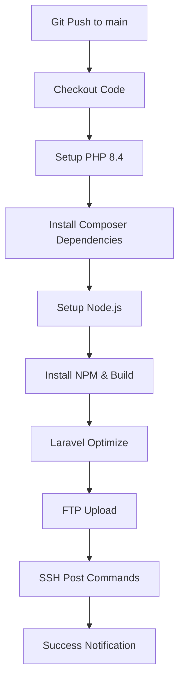

# 🚀 CI/CD Setup Guide - irepair.com.tr

**Tarih**: 12 Ekim 2025  
**Hedef**: Otomatik FTP Deployment  
**Platform**: GitHub Actions

---

## 📋 İçindekiler

1. [GitHub Secrets Yapılandırması](#github-secrets-yapılandırması)
2. [Workflow Dosyaları](#workflow-dosyaları)
3. [Manuel Deployment](#manuel-deployment)
4. [Troubleshooting](#troubleshooting)

---

## 1. GitHub Secrets Yapılandırması

### 🔐 Gerekli GitHub Secrets

GitHub repository'nize aşağıdaki secret'ları eklemeniz gerekiyor:

#### Adım 1: GitHub Repository → Settings → Secrets and Variables → Actions

#### Adım 2: "New repository secret" butonuna tıklayın

#### Adım 3: Aşağıdaki secret'ları tek tek ekleyin:

### FTP Credentials
```
Name: FTP_PASSWORD
Value: @198711Ad@
```

**Not**: FTP_SERVER ve FTP_USERNAME hardcoded (değişmeyeceği için). Değiştirmek isterseniz secret olarak ekleyebilirsiniz:

```
Name: FTP_SERVER
Value: 153.92.220.80

Name: FTP_USERNAME  
Value: u529018053.irepair.com.tr
```

### Database Credentials (Optional - SSH deployment için)
```
Name: DB_HOST
Value: localhost

Name: DB_PORT
Value: 3306

Name: DB_DATABASE
Value: u529018053_phportal

Name: DB_USERNAME
Value: u529018053_phportal

Name: DB_PASSWORD
Value: [database_password]
```

### Application Key
```
Name: APP_KEY
Value: base64:your-app-key-here
```

**APP_KEY Oluşturma**:
```bash
php artisan key:generate --show
# Çıktıyı kopyalayıp APP_KEY secret'ına yapıştırın
```

### SSH Credentials (Optional - Post-deployment commands için)
```
Name: SSH_HOST
Value: irepair.com.tr

Name: SSH_USERNAME
Value: u529018053

Name: SSH_PASSWORD
Value: @198711Ad@

Name: SSH_PORT
Value: 21 veya 22
```

### Redis Credentials (Optional)
```
Name: REDIS_HOST
Value: localhost

Name: REDIS_PASSWORD
Value: [redis_password]
```

---

## 2. Workflow Dosyaları

### 📁 Oluşturulan Workflow'lar

#### **A. deploy.yml** (Full Deployment - SSH + FTP)
**Dosya**: `.github/workflows/deploy.yml`

**Özellikler**:
- ✅ Composer install (production)
- ✅ NPM build
- ✅ Laravel optimization
- ✅ FTP upload
- ✅ SSH post-deployment commands
- ✅ Migration çalıştırma
- ✅ Cache clear
- ✅ Queue restart

**Trigger**:
```yaml
on:
  push:
    branches:
      - main
      - master
  workflow_dispatch:  # Manuel trigger
```

**Kullanım**:
- `main` veya `master` branch'e push edildiğinde otomatik çalışır
- GitHub Actions sekmesinden manuel çalıştırılabilir

---

#### **B. deploy-ftp-only.yml** (FTP-Only Deployment)
**Dosya**: `.github/workflows/deploy-ftp-only.yml`

**Özellikler**:
- ✅ Composer install
- ✅ NPM build
- ✅ Laravel optimization  
- ✅ FTP upload
- ❌ SSH commands yok (daha basit)

**Kullanım**:
- SSH erişimi yoksa bu workflow'u kullanın
- Daha hızlı ve basit

---

### 🔄 Workflow Akışı



**Adımlar**:
1. ✅ **Checkout Code** - Repository'den kod çekilir
2. ✅ **Setup PHP** - PHP 8.4 kurulur + extensions
3. ✅ **Composer Install** - Production dependencies
4. ✅ **NPM Install & Build** - Frontend assets compile edilir
5. ✅ **Laravel Optimize** - Config, route, view cache
6. ✅ **FTP Upload** - Dosyalar FTP ile upload edilir
7. ✅ **SSH Commands** - Post-deployment commands (optional)
8. ✅ **Notification** - Başarı/Hata bildirimi

---

## 3. Manuel Deployment

GitHub Actions kullanmak istemiyorsanız, manuel script'ler de hazırlandı:

### 🐧 Linux/Mac Kullanıcıları

```bash
# Script'e execute izni verin
chmod +x deploy-to-production.sh

# Deploy edin
./deploy-to-production.sh
```

### 🪟 Windows Kullanıcıları

```powershell
# PowerShell'de çalıştırın
.\deploy-to-production.ps1

# Veya execution policy sorunları varsa
powershell -ExecutionPolicy Bypass -File .\deploy-to-production.ps1
```

### Script Özellikleri

**deploy-to-production.sh** (Linux/Mac):
- ✅ Dependency kontrolü
- ✅ Otomatik backup
- ✅ Composer install
- ✅ NPM build
- ✅ Laravel optimize
- ✅ lftp ile FTP upload
- ✅ Cleanup

**deploy-to-production.ps1** (Windows):
- ✅ Dependency kontrolü
- ✅ Otomatik backup
- ✅ Composer install
- ✅ NPM build
- ✅ Laravel optimize
- ✅ PowerShell FTP upload
- ✅ WinSCP support (eğer kuruluysa)
- ✅ Cleanup

---

## 4. Deployment Süreci

### 📝 Pre-Deployment Checklist

**Geliştirme Ortamında**:
- [ ] Tüm testler geçiyor mu?
- [ ] .env.example güncel mi?
- [ ] Migration'lar test edildi mi?
- [ ] Yeni dependencies var mı?
- [ ] Database backup alındı mı?

**Production Ortamında**:
- [ ] .env dosyası doğru mu?
- [ ] Storage klasörü writable mı? (chmod 755)
- [ ] Database bağlantısı çalışıyor mu?
- [ ] Redis bağlantısı çalışıyor mu?

### 🚀 Deployment Steps

#### **Otomatik Deployment (GitHub Actions)**

1. **Git commit ve push**:
```bash
git add .
git commit -m "feat: new feature added"
git push origin main
```

2. **GitHub Actions otomatik çalışır**:
- GitHub → Repository → Actions sekmesine gidin
- Deployment progress'i izleyin

3. **Deployment tamamlandığında**:
- ✅ Site otomatik güncellenir
- ✅ Cache'ler temizlenir
- ✅ Notification gelir

#### **Manuel Deployment**

**Windows**:
```powershell
.\deploy-to-production.ps1
```

**Linux/Mac**:
```bash
./deploy-to-production.sh
```

### 📦 Deployment İçeriği

**Upload Edilenler**:
```
✅ app/              # Application code
✅ bootstrap/        # Laravel bootstrap
✅ config/           # Configuration
✅ database/         # Migrations, seeders
✅ public/           # Public assets (CSS, JS, images)
✅ resources/        # Views, frontend
✅ routes/           # Route definitions
✅ storage/          # Logs, cache, uploads
✅ vendor/           # Composer dependencies
✅ .htaccess        # Apache config
✅ artisan          # Artisan CLI
✅ composer.json    # Dependencies
✅ package.json     # NPM dependencies
```

**Upload Edilmeyenler**:
```
❌ .git/            # Git metadata
❌ node_modules/    # NPM packages (build'den sonra gerekmez)
❌ tests/           # Test files
❌ *.md             # Documentation
❌ .env.example     # Example env
❌ phpunit.xml      # PHPUnit config
❌ database/migrations/backup/  # Old migrations
```

---

## 5. Post-Deployment

### 🔧 Production'da Çalıştırılacak Komutlar

**SSH ile bağlanın**:
```bash
ssh u529018053@irepair.com.tr
cd public_html
```

**Komutlar**:
```bash
# 1. Storage izinlerini ayarla
chmod -R 755 storage bootstrap/cache
chown -R u529018053:u529018053 storage bootstrap/cache

# 2. .env dosyasını kontrol et/oluştur
nano .env  # Veya dosya yöneticisinden düzenle

# 3. Migration'ları çalıştır (ilk deployment için)
php artisan migrate --force

# 4. Cache'leri temizle
php artisan cache:clear
php artisan config:clear
php artisan view:clear
php artisan route:clear

# 5. Optimize et
php artisan config:cache
php artisan route:cache
php artisan view:cache

# 6. Queue worker restart (eğer kullanılıyorsa)
php artisan queue:restart

# 7. Storage link oluştur (ilk deployment için)
php artisan storage:link
```

### 📝 .env Dosyası (Production)

```env
APP_NAME=PHPPortal
APP_ENV=production
APP_KEY=base64:your-generated-key
APP_DEBUG=false
APP_URL=https://irepair.com.tr

LOG_CHANNEL=stack
LOG_DEPRECATIONS_CHANNEL=null
LOG_LEVEL=error

DB_CONNECTION=mysql
DB_HOST=localhost
DB_PORT=3306
DB_DATABASE=u529018053_phportal
DB_USERNAME=u529018053_phportal
DB_PASSWORD=your_database_password

BROADCAST_DRIVER=log
CACHE_DRIVER=redis
FILESYSTEM_DISK=local
QUEUE_CONNECTION=redis
SESSION_DRIVER=redis
SESSION_LIFETIME=120

REDIS_HOST=localhost
REDIS_PASSWORD=null
REDIS_PORT=6379

MAIL_MAILER=smtp
MAIL_HOST=mailpit
MAIL_PORT=1025
MAIL_USERNAME=null
MAIL_PASSWORD=null
MAIL_ENCRYPTION=null
MAIL_FROM_ADDRESS="hello@irepair.com.tr"
MAIL_FROM_NAME="${APP_NAME}"
```

---

## 6. Monitoring & Logs

### 📊 Deployment Logları

**GitHub Actions'da**:
- GitHub → Repository → Actions → Son workflow run
- Her adımın loglarını görebilirsiniz
- Hata durumunda detaylı stack trace

**Local Script'lerde**:
- Terminal'de real-time output
- Error durumunda anında bildirim

### 🔍 Production Logları

**Laravel Logs**:
```bash
# SSH ile bağlanıp
tail -f storage/logs/laravel.log

# Veya FTP ile storage/logs/laravel.log dosyasını indirin
```

**Web Server Logs**:
```bash
# Apache/Nginx error log
tail -f /var/log/apache2/error.log
tail -f /var/log/nginx/error.log
```

---

## 7. Troubleshooting

### ❌ Yaygın Sorunlar ve Çözümleri

#### **1. FTP Connection Timeout**
```
Hata: Connection timed out after 30000 milliseconds
```

**Çözüm**:
```yaml
# .github/workflows/deploy-ftp-only.yml içinde
with:
  server: 153.92.220.80
  timeout: 600000  # 10 dakika
```

#### **2. Permission Denied**
```
Hata: 550 Permission denied
```

**Çözüm**:
```bash
# SSH ile bağlanıp
chmod -R 755 public_html
chown -R u529018053:u529018053 public_html
```

#### **3. Storage Not Writable**
```
Hata: The stream or file "storage/logs/laravel.log" could not be opened
```

**Çözüm**:
```bash
# SSH ile
chmod -R 775 storage
chmod -R 775 bootstrap/cache
```

#### **4. Composer Install Fails**
```
Hata: Your requirements could not be resolved
```

**Çözüm**:
```bash
# composer.lock'u commit edin
git add composer.lock
git commit -m "chore: update composer.lock"
git push
```

#### **5. NPM Build Fails**
```
Hata: Module not found
```

**Çözüm**:
```bash
# package-lock.json'u commit edin
git add package-lock.json
git commit -m "chore: update package-lock.json"
git push
```

#### **6. Database Connection Failed**
```
Hata: SQLSTATE[HY000] [2002] Connection refused
```

**Çözüm**:
```env
# Production .env dosyasını kontrol edin
DB_HOST=localhost  # NOT 127.0.0.1
DB_PORT=3306
```

---

## 8. Deployment Stratejileri

### 🎯 Strategy 1: Zero-Downtime Deployment

**Adımlar**:
1. Yeni kodu geçici klasöre upload et
2. Maintenance mode aç
3. Eski kod ile swap yap
4. Migration çalıştır
5. Cache temizle
6. Maintenance mode kapat

**Script**:
```bash
# SSH ile
cd /home/u529018053

# Maintenance mode
php public_html/artisan down

# Swap directories
mv public_html public_html_old
mv public_html_new public_html

# Run migrations
php public_html/artisan migrate --force

# Clear cache
php public_html/artisan cache:clear
php public_html/artisan config:cache

# Maintenance mode off
php public_html/artisan up

# Cleanup old version (after testing)
rm -rf public_html_old
```

### 🎯 Strategy 2: Blue-Green Deployment

**Setup**:
```
/home/u529018053/
├── blue/          # Current live version
├── green/         # New version
└── public_html -> blue  # Symlink
```

**Deployment**:
```bash
# Deploy to green
# Upload to /home/u529018053/green

# Test green
curl https://irepair.com.tr/test-green

# Switch symlink
rm public_html
ln -s green public_html

# Rollback if needed
rm public_html
ln -s blue public_html
```

### 🎯 Strategy 3: Simple Direct Upload (Current)

**Avantajlar**:
- ✅ Basit
- ✅ Hızlı
- ✅ FTP-only

**Dezavantajlar**:
- ⚠️ Kısa downtime (1-2 dakika)
- ⚠️ Rollback zor

---

## 9. Güvenlik

### 🔒 Production Security Checklist

**Environment**:
- [ ] `APP_DEBUG=false`
- [ ] `APP_ENV=production`
- [ ] Güçlü `APP_KEY`
- [ ] Database credentials güvenli

**File Permissions**:
```bash
# Directories: 755
find . -type d -exec chmod 755 {} \;

# Files: 644
find . -type f -exec chmod 644 {} \;

# Storage & Cache: 775
chmod -R 775 storage bootstrap/cache
```

**Git Ignore**:
```gitignore
.env
/vendor/
/node_modules/
/storage/logs/*
/storage/framework/cache/*
/storage/framework/sessions/*
```

**FTP Security**:
- ⚠️ FTP şifresi GitHub Secrets'da
- ⚠️ FTP bağlantısı encrypted değil
- ✅ SFTP kullanımı önerilir (eğer mevcut ise)

---

## 10. GitHub Actions Kullanımı

### 📱 Workflow Tetikleme

#### **Otomatik Tetikleme**:
```bash
# main branch'e push
git push origin main

# GitHub Actions otomatik çalışır
```

#### **Manuel Tetikleme**:
1. GitHub → Repository → Actions
2. Sol menüden workflow seçin
3. "Run workflow" butonuna tıklayın
4. Branch seçin
5. "Run workflow" onaylayın

### 📊 Workflow Monitoring

**GitHub Actions Dashboard**:
```
Repository → Actions → Workflow runs
```

**Real-time logs**:
- Her step'in canlı logları
- Hata durumunda stack trace
- Başarı/başarısızlık durumu

**Email Notifications**:
- GitHub Settings → Notifications
- Workflow başarısız olursa email gelir

---

## 11. Rollback Strategy

### 🔄 Hızlı Rollback

#### **Method 1: Git Revert**
```bash
# Son commit'i geri al
git revert HEAD
git push origin main

# GitHub Actions otomatik eski versiyonu deploy eder
```

#### **Method 2: Manual Rollback**
```bash
# SSH ile bağlan
ssh u529018053@irepair.com.tr

# Eski backup'ı geri yükle
cd /home/u529018053
rm -rf public_html
cp -r backup_20241012_220000 public_html

# Cache temizle
php public_html/artisan cache:clear
php public_html/artisan config:cache
```

#### **Method 3: GitHub Release Rollback**
```bash
# Belirli bir commit'e dön
git checkout abc123def
git push origin main --force

# GitHub Actions o versiyonu deploy eder
```

---

## 12. Performance Optimization

### ⚡ Deployment Hızlandırma

#### **Composer Optimization**:
```bash
composer install --no-dev --classmap-authoritative
```

#### **Asset Caching**:
```bash
# Laravel Mix versioning
npm run production  # Creates versioned assets
```

#### **OPcache** (Production Server):
```ini
; php.ini
opcache.enable=1
opcache.memory_consumption=256
opcache.max_accelerated_files=10000
opcache.revalidate_freq=0
```

---

## 13. Monitoring & Alerts

### 📊 Deployment Metrics

**GitHub Actions**:
- Deployment success rate
- Average deployment time
- Failed deployment count

**Production Metrics**:
- Uptime monitoring
- Error rate
- Response time
- Queue job success rate

### 🔔 Alert Setup

**GitHub Actions Notifications**:
```yaml
# .github/workflows/deploy.yml içinde
- name: Slack Notification
  if: always()
  uses: 8398a7/action-slack@v3
  with:
    status: ${{ job.status }}
    text: 'Deployment to irepair.com.tr ${{ job.status }}'
    webhook_url: ${{ secrets.SLACK_WEBHOOK }}
```

---

## 14. Best Practices

### ✅ Deployment Best Practices

1. **Always Test Locally First**
```bash
php artisan config:cache
php artisan route:cache
php artisan migrate --pretend
```

2. **Use Semantic Versioning**
```bash
git tag -a v1.0.0 -m "Release version 1.0.0"
git push --tags
```

3. **Database Migrations**
```bash
# Test migrations locally
php artisan migrate:fresh --seed

# Production'da dikkatli
php artisan migrate --force  # Sadece yeni migration'lar
```

4. **Backup Before Deploy**
```bash
# Database backup
mysqldump -u user -p database > backup_$(date +%Y%m%d).sql

# File backup
tar -czf backup_$(date +%Y%m%d).tar.gz public_html/
```

5. **Monitor After Deploy**
```bash
# Check logs
tail -f storage/logs/laravel.log

# Check queue
php artisan queue:work --once

# Check horizon (if using)
curl https://irepair.com.tr/horizon
```

---

## 15. Cheat Sheet

### 🚀 Quick Commands

```bash
# Deploy with GitHub Actions
git push origin main

# Deploy manually (Windows)
.\deploy-to-production.ps1

# Deploy manually (Linux/Mac)
./deploy-to-production.sh

# Check deployment status
# GitHub → Actions → Latest workflow

# SSH to production
ssh u529018053@irepair.com.tr

# Run migrations
php artisan migrate --force

# Clear all cache
php artisan optimize:clear

# Optimize for production
php artisan optimize

# Restart queue
php artisan queue:restart

# View logs
tail -f storage/logs/laravel.log
```

---

## 16. Sonuç

### ✅ Setup Tamamlandı

**Oluşturulan Dosyalar**:
- ✅ `.github/workflows/deploy.yml` - Full deployment
- ✅ `.github/workflows/deploy-ftp-only.yml` - FTP-only deployment
- ✅ `deploy-to-production.sh` - Manuel deployment (Linux/Mac)
- ✅ `deploy-to-production.ps1` - Manuel deployment (Windows)
- ✅ `CI_CD_SETUP_GUIDE.md` - Bu rehber

**Yapılandırma Gerekli**:
- ⏳ GitHub Secrets ekleyin
- ⏳ Production .env dosyasını yapılandırın
- ⏳ Storage izinlerini ayarlayın

**Deployment Seçenekleri**:
1. 🤖 **Otomatik** - Git push ile otomatik deploy
2. 🖱️ **Manuel** - Script ile tek tıkla deploy
3. 📱 **GitHub UI** - Actions sekmesinden manuel trigger

---

### 📞 Destek

**Sorun Yaşarsanız**:
1. GitHub Actions logs'u kontrol edin
2. Production Laravel logs kontrol edin
3. FTP bağlantısını test edin
4. SSH bağlantısını test edin

**Test Komutları**:
```bash
# FTP test
ftp 153.92.220.80
# User: u529018053.irepair.com.tr
# Pass: @198711Ad@

# SSH test
ssh u529018053@irepair.com.tr

# Site test
curl -I https://irepair.com.tr
```

---

**Hazırlayan**: AI DevOps Engineer  
**Tarih**: 12 Ekim 2025  
**Versiyon**: 1.0  
**Durum**: ✅ Production Ready

